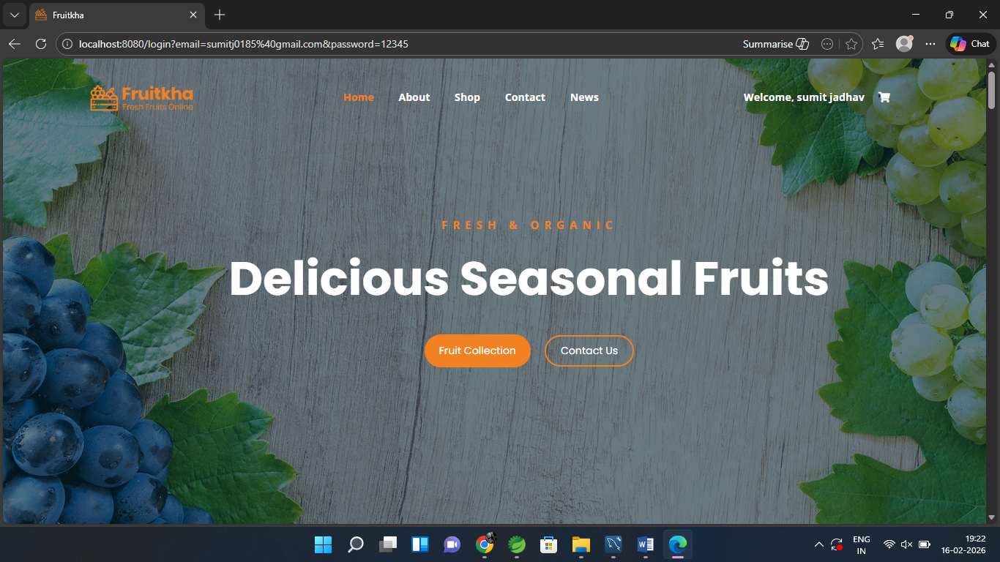

# 🍎 Fruits Market Web Application

## 📌 Project Description

Fruits Market is a dynamic e-commerce web application developed using Spring Tool Suite. The system allows users to browse fruits, add products to cart, and complete purchases using an integrated online payment system.

The application also includes an Admin panel to manage products and users efficiently.

---

## 🚀 Features

### 👤 User Module

* User Registration & Login
* Browse Fruits Products
* Add to Cart
* Proceed to Payment
* Online Payment Integration (Razorpay)
* Payment Success Page
* Return to Home Page

### 🛠️ Admin Module

* Admin Login
* Add Products
* Update Products
* Delete Products
* Manage Users (Add, Update, Delete)

---

## 💳 Payment Integration

* Integrated Razorpay Payment Gateway
* Secure online transactions
* Payment success confirmation page

---

## 🖥️ Pages Included

* Home Page
* Login Page
* Registration Page
* Product Page
* Add to Cart Page
* Payment Page
* Payment Success Page
* About Us Page
* Contact Us Page

---

## 🛠️ Tech Stack

* Java
* Spring Framework
* Spring Boot
* JSP / Servlet
* HTML, CSS, JavaScript
* MySQL Database
* Razorpay Payment Gateway

---

# fruitsMarket 🛒

## 📸 Screenshots

### 🏠 Home Page


### 🔐 Login Page


### 📝 Register Page


### 🛍️ Products Page


### 🛒 Add To Cart


### 💳 Proceed To Payment


### 💰 Payment Gateway


### ✅ Payment Success


### 📞 Contact Page


### 📰 News Page


---

## ⚙️ How to Run Project

1. Clone the repository

```
git clone https://github.com/your-username/fruits-market.git
```

2. Open in Spring Tool Suite

3. Configure MySQL Database

4. Run the project on server (Tomcat / Spring Boot)

5. Open browser:

```
http://localhost:8080/
```

---

## 📈 Future Enhancements

* Order History
* Email Notifications
* Product Reviews & Ratings
* Search & Filter Functionality

---

## 👨‍💻 Author

**Sumit Avinash Jadhav**

* MCA Graduate
* Java Developer

---

## 📬 Contact

For any queries or collaboration feel free to connect.

---

⭐ If you like this project, don't forget to give it a star!
